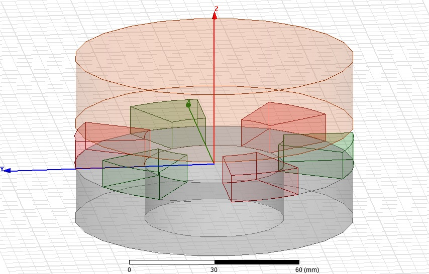
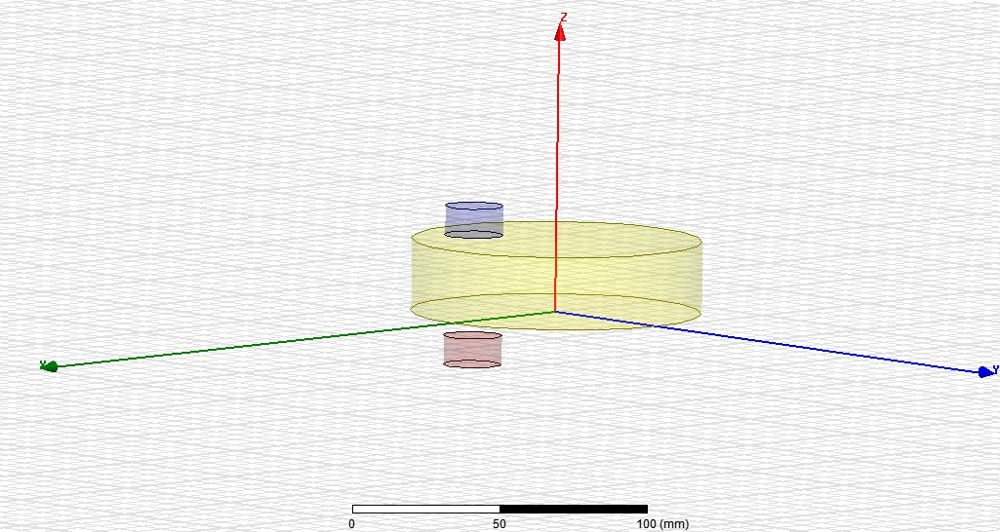

#### C- Eddy Current Brake Design

Notlarını buraya da alabilirsin

The project aims to design a Eddy current braking system. Eddy current brakes utilize eddy current produced in a conductive material by a changing magnetic field to generate smooth braking torque in contrast with traditional friction braking.

An eddy current braking system consists of one or more cores or permanent magnet with a small air gap, and a rotating disc with conductive properties. This coil encases a core material which has magnetic properties. The number of turns in the coil is dependent on the desired magnetic field strength and braking force. Eddy currents produce an opposing magnetic field to slow down an object such as a conductive rotating disc. These forces are created by inducing a current through the coil when a disc, with conductive properties rotate within the air gap. The magnitude of these forces is dependent on the conductivity of the conductor and the rate the magnetic field changes.

Resimleri de boyle ekleyebilirsin

